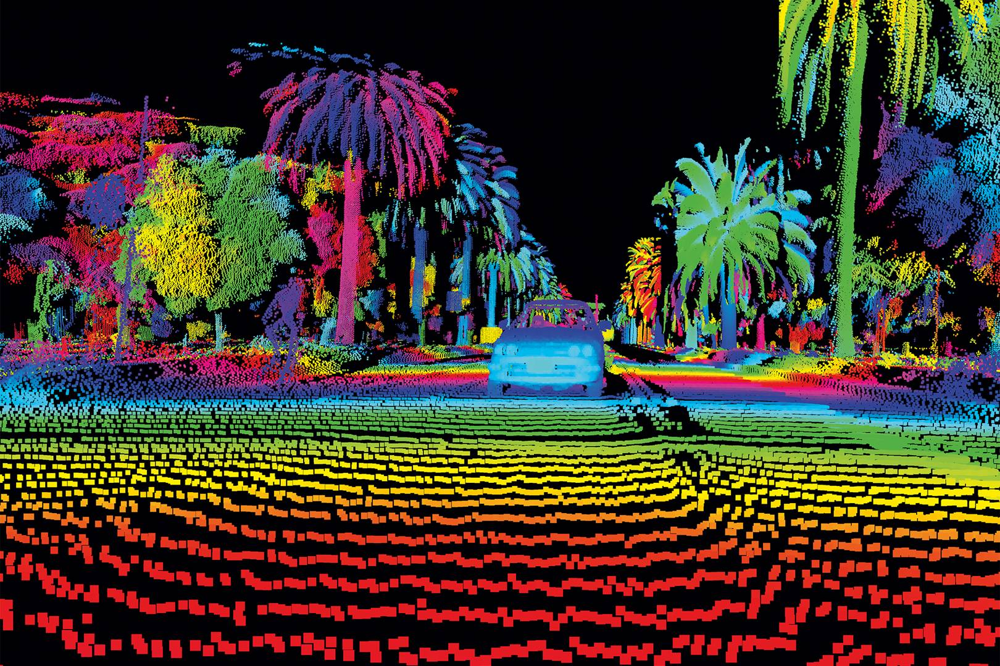
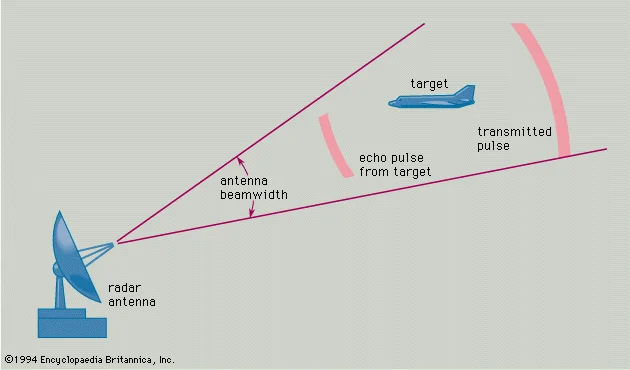
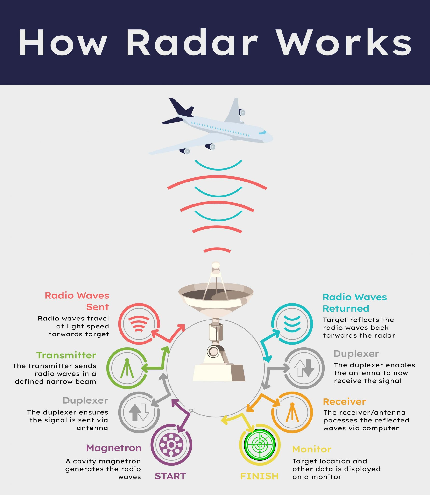
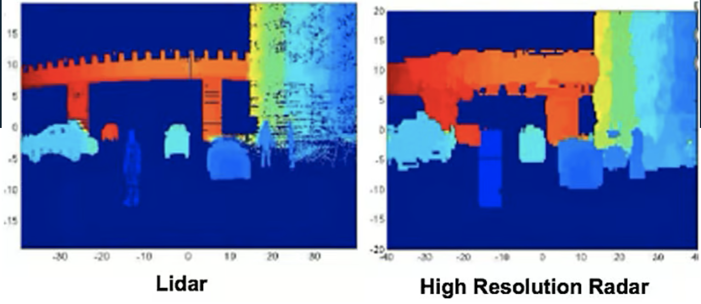

class: center middle
```{r setup, include=FALSE}
options(htmltools.dir.version = FALSE)
```

```{r xaringan-themer, include=FALSE, warning=FALSE}
library(xaringanthemer)
style_duo_accent(
  primary_color = "#327CA7",
  secondary_color = "#FFC94A",
  inverse_header_color = "#1C5174",
  inverse_text_color = "#1C5174",
  header_font_google = google_font("Ubuntu"),
  text_font_google   = google_font("Montserrat", "400", "400i"),
  code_font_google   = google_font("Fira Mono"),
  title_slide_background_image = "img/space.jpg"
)
```


```{r xaringan-all, echo=FALSE}
library(countdown)
library(xaringan)
library(xaringanExtra)
library(knitr)
hook_source <- knitr::knit_hooks$get('source')
knitr::knit_hooks$set(source = function(x, options) {
  x <- stringr::str_replace(x, "^[[:blank:]]?([^*].+?)[[:blank:]]*#<<[[:blank:]]*$", "*\\1")
  hook_source(x, options)
})
xaringanExtra::use_tile_view()
xaringanExtra::use_broadcast()
xaringanExtra::use_panelset()
xaringanExtra::use_tachyons()
xaringanExtra::use_search(show_icon = TRUE, auto_search = FALSE)
xaringanExtra::use_progress_bar(color = "#FFC94A", location = "bottom")
```

```{r load_packages, message=FALSE, warning=FALSE, include=FALSE}
library(fontawesome)
```

# Summary

LiDAR & RADAR


---

## LiDAR

.panelset.sideways[
.panel[.panel-name[**Definition**]

LiDAR is the [Light Detection and Ranging](https://oceanservice.noaa.gov/facts/lidar.html) is a remote sensing method used to examine the surface of the Earth

It is a remote sensing technology that **uses laser pulses to measure the distance between the LiDAR system and objects or surfaces on the Earth's surface**. 


]

.panel[.panel-name[**How it works?**]

- Emits a laser pulse and **measures the time it takes for the laser to hit the target and return**

- A method of measuring the distance to an object using **light**

```{r echo=FALSE, out.width='65%', fig.align='center'}

```

.small[Source::[geospatialworld](https://www.geospatialworld.net/prime/technology-and-innovation/what-is-lidar-technology-and-how-does-it-work/)]


]
]

---
class: center middle

# What is RADAR?

RADAR(RAdio Detecting And Ranging)


---
## RADAR

.panelset.sideways[
.panel[.panel-name[**Definition**]

- It works in the same way as LiDAR, but uses **radio waves** instead of lasers to measure

```{r echo=FALSE, out.width='65%', fig.align='center'}

```

.small[Source::[britannica](https://www.britannica.com/technology/radar)]


]

.panel[.panel-name[**How it works?**]

Emits radio waves, hits an object, and returns data to determine the distance, speed, and direction information of the object that hits the object and returns

```{r echo=FALSE, out.width='40%', fig.align='center'}

```

.small[Source::[Radar Basics](https://lidarradar.com/info/how-radars-work?utm_content=cmp-true)]


]
]

---

## Compare Advantages

.panelset.sideways[
.panel[.panel-name[**LiDAR**]

- provide accurate 3D images

- High precision

```{r echo=FALSE, out.width='65%', fig.align='center'}

```

.small[Source::[compare](https://www.fierceelectronics.com/components/lidar-vs-radar)]

]

.panel[.panel-name[**RADAR**]

- Possible to measure **long-distance object**

- Unaffected by weather conditions (e.g. fog, snow, humidity)

- Provide accurate measurements of the distance, speed, and direction of moving objects

- Recognize hidden objects


]
]

---
## Compare Disdvantages

.panelset.sideways[
.panel[.panel-name[**LiDAR**]

- Expensive equipment

- Comparatively short detection range compared to RADAR

- Sensitive to weather conditions

- Unable to detect occluded objects


]

.panel[.panel-name[**RADAR**]

- Difficulty identifying small objects

- Difficulty in providing precise images

- In some cases, it is impossible to determine the type of object

]
]

---


class: inverse center middle

# Application

---

## Sensor Technology in Autonomous Vehicles : A review

This week I read 'Sensor Technology in Autonomous Vehicles : A review' by S. Campbell et al. This artivle provides an overview of the sensor technology used in autonomous vehicles. The authors discuss the various sensors that are currently used in autonomous vehicles, including cameras, LiDAR, radar, and GPS. They describe the advantages and disadvantages of each sensor technology. Futhermore, they highlight the importance of sensor fusion in achieving reliable and accurate perception.

.small[Source::[reference](https://ieeexplore.ieee.org/document/8585340)]
---


class: inverse center middle

# Personal refelction

---

## In this week..

I learned about **xaringan**. I used PowerPoint or Prezi for presentations. These two are easy to use at first, but somewhat complicated screen composition and unnecessarily effects sometimes produce messy results. It is difficult for beginners to grasp the concept of R and the operating principle of Xaringan. However, I am sure that once you get used to it, you will be **fascinated by the clean interface and screen composition** (I especially like the fact that the screen is divided and composed using panels). It was a good opportunity to learn other functions besides data analysis through the R I learned last semester. If I have a chance to give a presentation at a company in the future when I return to Korea, I plan to use xaringan.


